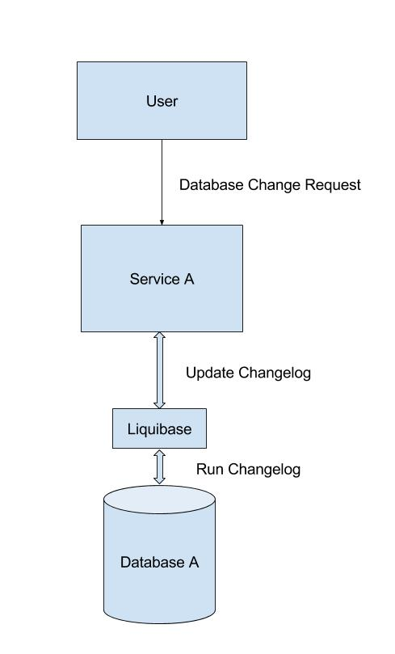

For the past 2 weeks, I have been researching on the problems while dealing with Database Versioning and the possible solutions while modifying the underlying schema and migrating the database.

***

## Problem Statement:

Database is a critical part of any application. If you deploy 'x' version of the application against 'y' version of the database, then all you get is a broken application. The goal is to propagate changes from development, to test, and ultimately to production in a controlled and consistent manner and also to have the ability to recreate the database a database at any given point in time. Due to these constraints, it is always better to implement version control for the database used in our applications.

We need an implementation where we can update the state of the database without breaking the build or losing critical data. The solution involves implementing a database versioning tool while ensuring that the versioning process is traceable, visible, fault-tolerant and convenient.

I have also taken up the same problem for my Google Summer of Code Proposal. I will be working with Science Gateways Group at the Research Technologies on the open problem of Database Versioning in Apache Airavata.

***

## Possible Solutions:

As discussed in my earlier blog entries, I have considered 2 possible solutions for the given problem.

Method | Source
------- | -------
Liquibase | [liquibase.org](http://www.liquibase.org/)
Flyway | [flywaydb.org](https://flywaydb.org/)

***

## Solution Evaluation:

Modern ORMs like Hibernate make defining the schema and interacting with the data easier. But the job of migrating data from an old version to the latest version is still complicated.

We need a tool that would help in finding the difference between what the current production schema has and what the new production code needs. The tool should also describe how to migrate the schema and data from V1 -> V2 as easily as possible.

### FlyWay

For this approach, you have to give a definition of your schema and then any changes made to the DB must be done through describing migrations in the tool. But the changes should be mentioned only in SQL format. Also, it doesn't support multiple databases and neither does it have any feature with which we can perform a DBDiff. These are some of the reasons why I chose to explore Liquibase as a solution.

### Liquibase

I have discussed about the features in Liquibase in my previous blogs. If the database has an existing system with an existing schema, with the help of the Liquibase CLI we can connect to an existing database and derive its initial model from that. Also, the changelog file can be in one of 4 formats - XML/JSON/YAML/SQL which gives us flexibility. Liquibase provides a jar to migrate an existing DB to all needed XML files automatically. Liquibase can generate automatic rollback commands for many DDL changes.

*** 

## Mechanism:

***

## Conclusion: